<div align="center">

  <h1>zonaKasir</h1>

  <p>zonaKasir is a Point of Sale (POS) web application built with <strong>Laravel 11</strong> and <strong>Filament 3</strong>.</p>

  <p>
    
    
    
    
    
  </p>
  
</div>

## Requirements

| Dependency | Version | Notes |
|-----------|---------|-------|
| **PHP** | ^8.4 | with extensions: BCMath, Ctype, Fileinfo, JSON, Mbstring, OpenSSL, PDO, Tokenizer, XML |
| **PostgreSQL** | 15+ | Primary database |
| **Node.js** | 18+ | For frontend build (Vite) |

> 💡 **Single database:** PostgreSQL 15+ is the only database engine.

## Features

### Core POS
- **Transaction Management**: Handle sales with cart, discounts, and multi-payment.
- **Product Management**: CRUD with categories, units, barcodes, stock tracking.
- **Unit Price**: Products priced per base unit; auto-conversion on different units.
- **Discount**: Per-item or global discount on transactions.
- **Barcode Support**: Scan barcodes on stock opname, purchasing, and POS.

### Inventory & Finance
- **Purchasing**: Manage purchase orders, suppliers, and stock receipts.
- **Stock Opname**: Conduct stock-taking with barcode scanning.
- **Receivable Management**: Track receivables (owed by/to business).
- **Payment Method Management**: Define cash, transfer, e-wallet, etc.
- **Simple Accounting**: Track income, expenses, and profit.

### Admin & Reporting
- **Role Management**: RBAC with Spatie Permission (roles & permissions).
- **Reporting**: Sales, stock, finance, and cashier reports.
- **Real-time Dashboard**: Monitor metrics at a glance.
- **Midtrans Payment Integration**: Online payment gateway.

### Advanced
- **Multi-tenancy**: Tenant-separated data (models under `app/Models/Tenants/`).
- **Web USB Direct Printing**: Thermal printer via browser (Chrome/Firefox).
- **Voucher Management**: Create, distribute, track voucher usage.
- **Firebase Cloud Messaging**: Push notifications to cashier devices.
- **Feature Flags**: Laravel Pennant for feature toggling.
- **Audit Logging**: Spatie Activitylog on 14 models.

## Screenshots

<div align="center">
  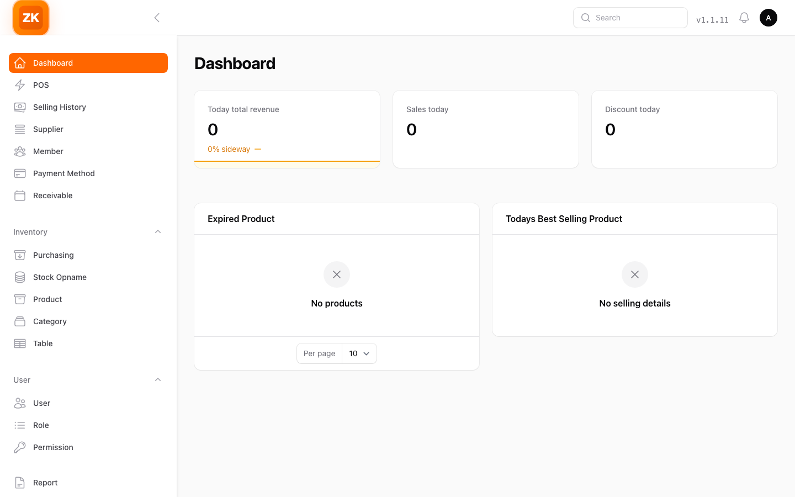
  &emsp;
  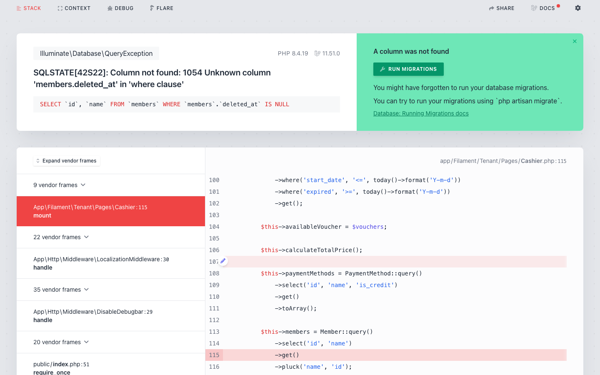
  <br/>
  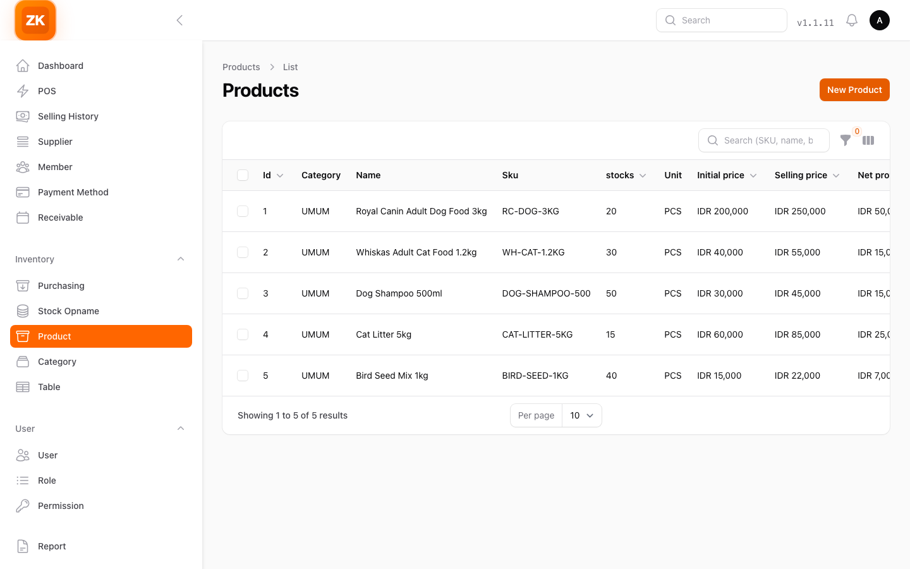
  &emsp;
  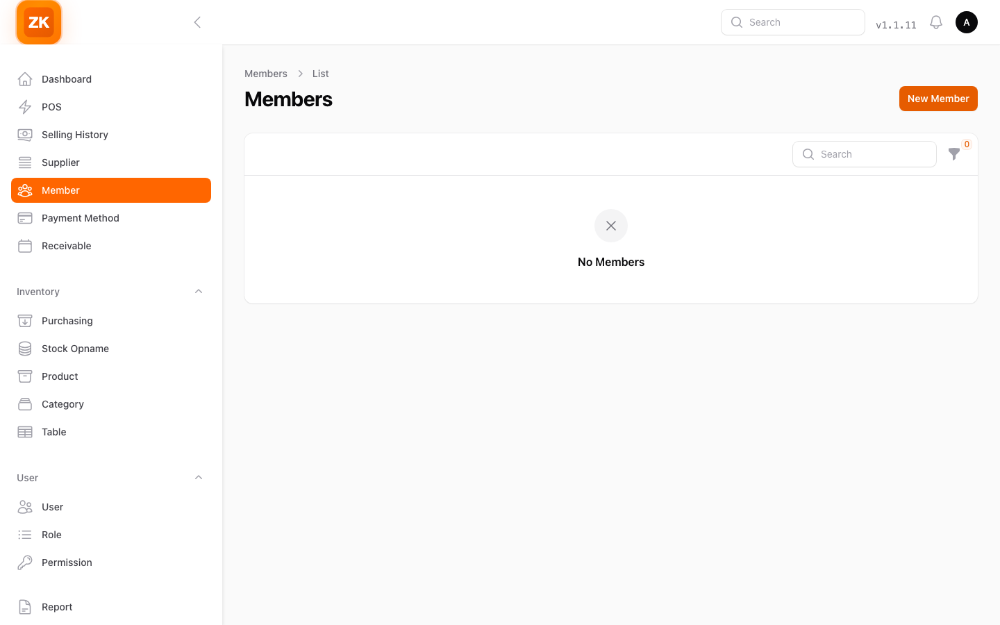
  <br/>
  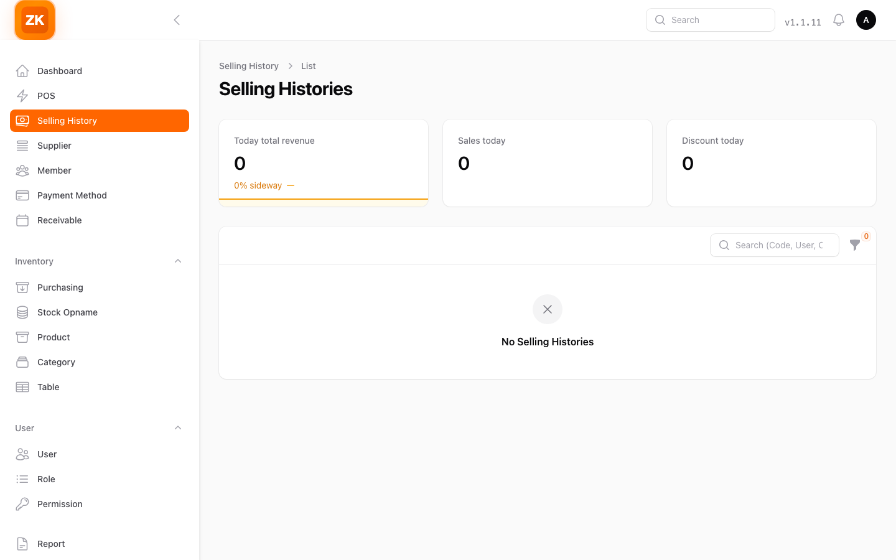
  &emsp;
  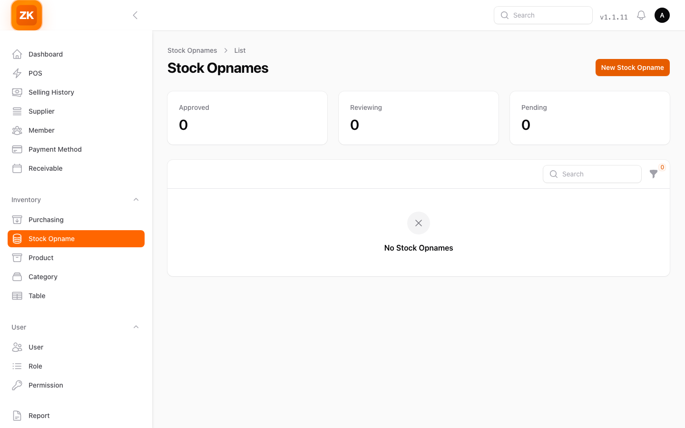
  <br/>
  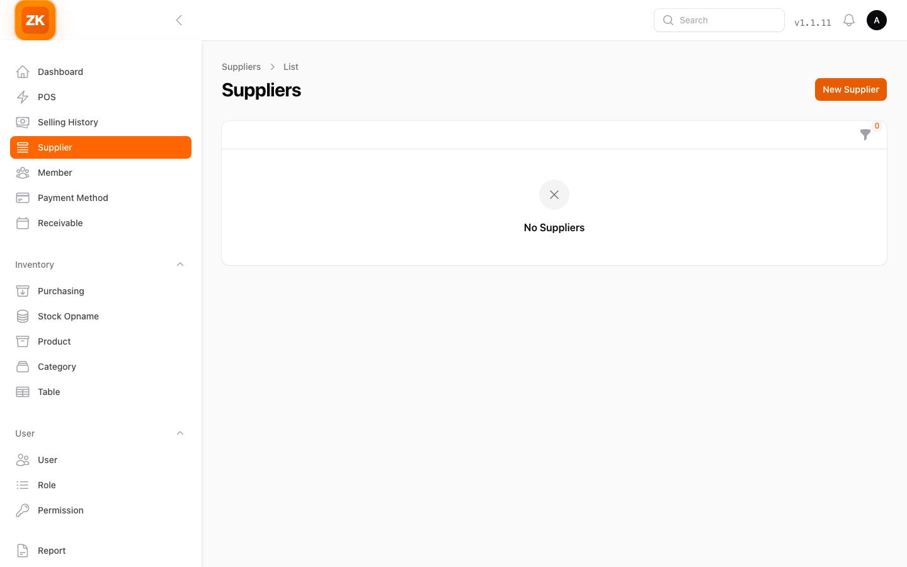
  &emsp;
  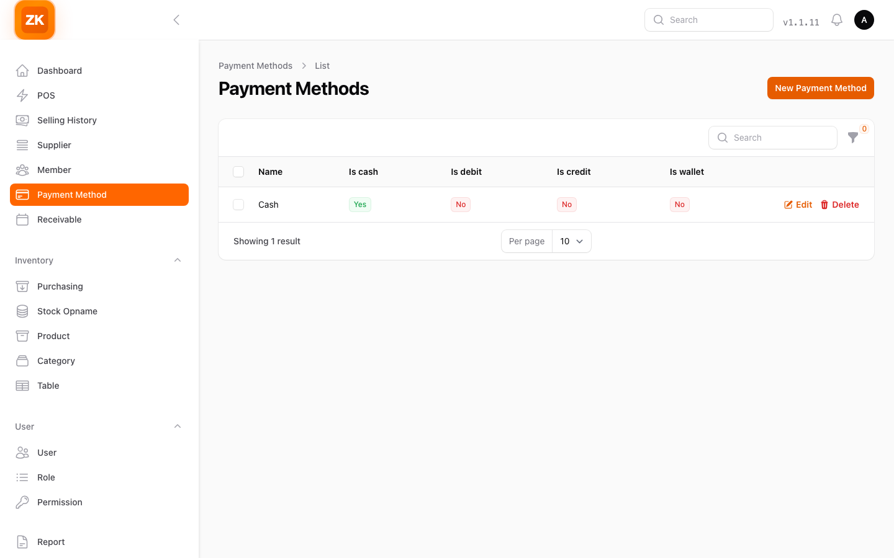
  <br/>
  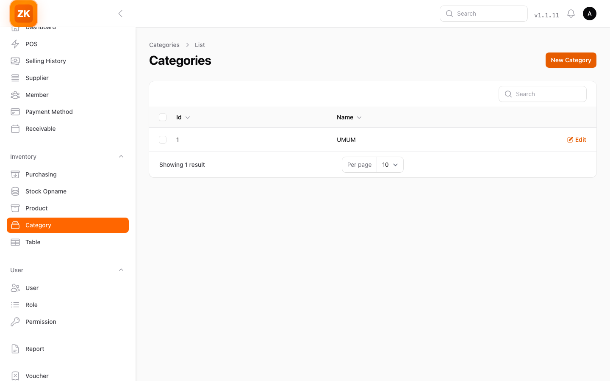
  &emsp;
  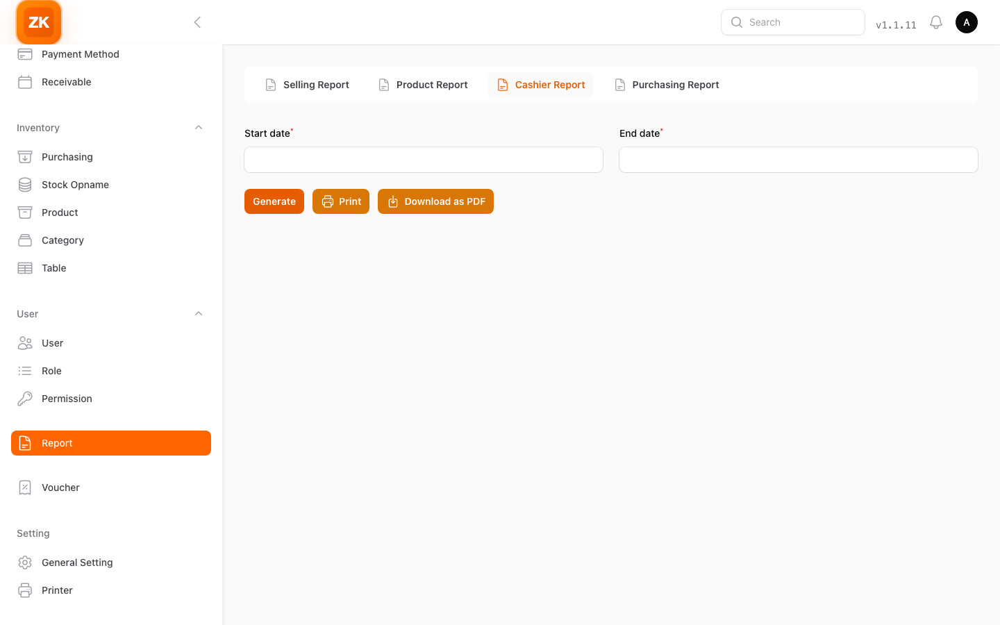
</div>

## Technologies Used

### Stack
| Layer | Technology | Version |
|-------|-----------|---------|
| **Backend** | [Laravel](https://laravel.com) | ^11.9 |
| **Admin Panel** | [Filament](https://filamentphp.com) | ^3.2 |
| **Frontend** | [Livewire](https://livewire.laravel.com) | ^3.0 |
| **Database** | PostgreSQL 15+ | — |
| **Build** | [Vite](https://vitejs.dev) | — |
| **Testing** | [Pest PHP](https://pestphp.com) | ^2.35 |

### Key Packages
- **Multi-tenancy**: Tenant-scoped models (`app/Models/Tenants/`) + separate tenant routes
- **Auth API**: `laravel/sanctum` ^4.0
- **Permissions**: `spatie/laravel-permission` (RBAC)
- **Payments**: `midtrans/midtrans-php` (online gateway)
- **Notifications**: `kreait/laravel-firebase` + `laravel-notification-channels/fcm`
- **Feature Flags**: `laravel/pennant` ^1.8
- **PDF**: `barryvdh/laravel-dompdf`
- **Social Login**: `laravel/socialite` ^5.27
- **Audit**: `spatie/laravel-activitylog`
- **Helpers**: `lakasir/has-crud-action`

### Testing Stack
- Pest PHP ^2.35 with plugins: Faker, Livewire, Browser (Dusk)
- 63 test files covering API, Feature, E2E, Unit
- Uses `RefreshDatabaseWithTenant` trait for multi-tenant tests

## Installation

### Prerequisites
- PHP ^8.4 with required extensions
- PostgreSQL 15+
- Composer, Node.js 18+, npm

### Setup
```bash
# 1. Clone
git clone https://github.com/argasokataman-code/zonaKasir.git
cd zonaKasir

# 2. Install PHP dependencies
composer install

# 3. Environment
cp .env.example .env
# Edit .env — set DB_* and other config for your local setup

# 4. Generate app key
php artisan key:generate

# 5. Run migrations & seed (tenant)
php artisan migrate --path=database/migrations/tenant --seed

# 6. Publish assets
php artisan filament:assets
php artisan livewire:publish --assets

# 7. Install JS dependencies & build
npm install
npm run build    # production
# OR
npm run dev      # development (Vite hot-reload)

# 8. Create admin user
# Register via web UI or seed: php artisan db:seed --class=UserSeeder
```

### Docker (Laravel Sail)
```bash
# Using Sail for local dev with MySQL
php artisan sail:install
./vendor/bin/sail up -d
./vendor/bin/sail artisan migrate --path=database/migrations/tenant --seed
```

## Usage

### API Endpoints
| Role | Base URL | Example |
|------|----------|---------|
| **Central/Admin** | `{host}/api/...` | `GET /api/products` |
| **Tenant** | `{host}/api/tenant/...` | `POST /api/tenant/transaction` |

### Web App
| App | URL | Auth |
|-----|-----|------|
| **Admin Panel** | `{host}/admin/login` | Email + password |
| **Cashier POS** | `{host}/member/login` | Member login |
| **Filament Dashboard** | `{host}/app` | Admin/Tenant role |

### Staging
- **URL**: `https://jogjatourdrive.com`
- **SSH**: `ssh -p 2223 jogn3455@jogjatourdrive.com`
- Auto-deploy on push to `main` branch

## Branch Strategy

| Branch | Hosting | Purpose |
|--------|---------|---------|
| `vercel` | Vercel (serverless) / Local | Active development |
| `main` | VPS (Docker) | Legacy staging (archived) |
| `feat/*` | — | Feature branches |
| `fix/*` | — | Bug fix branches |

> ⚠️ **Both branches use PostgreSQL** — `main` is legacy, `vercel` is default.

## Architecture Diagrams

| Diagram | File | Description |
|---------|------|-------------|
| 🏗️ **System Architecture** | [Overview](docs/architecture/OVERVIEW.md) | Layer stack, branches, request lifecycle |
| 🗄️ **DB Schema (ERD)** | [Database Schema](docs/architecture/DB_SCHEMA.md) | 7 entity-relationship diagrams |
| 🔄 **Business Flowcharts** | [Flowcharts](docs/architecture/FLOWCHART.md) | POS, auth, stock opname, purchasing, payment flows |

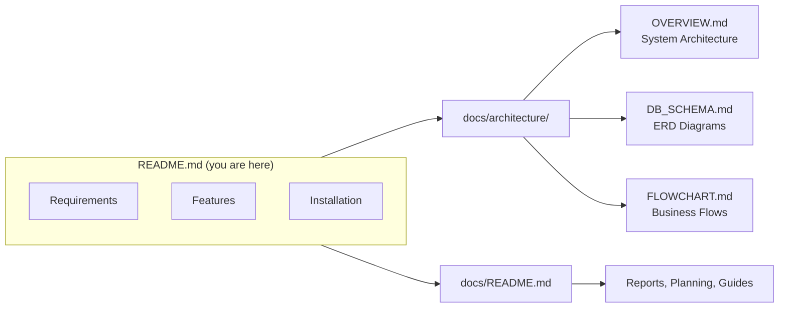

## Agent Development Rules

This repo includes **opencode agent rules** for AI-assisted development:

- `.opencode/rules/00-task-framework.mdc` — 6-phase task execution + MCP + Context7 + DB validation
- `.opencode/rules/01-code-style.mdc` — Code style, naming, build/test commands
- `.opencode/rules/02-security.mdc` — Security, deploy, CI/CD, git conventions

> 📖 Full docs: [docs/README.md](docs/README.md)

## Tests

```bash
# Run all tests
php artisan test

# Filter by name
php artisan test --filter=TestName

# Single file
php artisan test tests/Feature/Path/To/Test.php

# Pest directly
vendor/bin/pest --filter="test name"
```

## Contributing

We welcome contributions! Please follow:

1. **Fork** the repository.
2. **Branch**: Create from the right base:
   - MySQL changes → branch off `main`
   - PostgreSQL changes → branch off `vercel`
3. **Develop**: `git checkout -b feat/your-feature`
4. **Test**: Ensure `php artisan test` passes.
5. **PR**: Submit against the same base branch.

See [docs/README.md](docs/README.md) for full contribution guidelines.

## License

This project is licensed under the **GNU General Public License v3.0**.

**zonaKasir** is a rebranded & modified fork of [lakasir/lakasir](https://github.com/lakasir/lakasir), originally created by **Wahyu Hidayat** and contributors.  
We thank the original authors for their open-source work.

See the [LICENSE](LICENSE) file for the full license text.

## Contact

- **Email**: zonakasirapp@gmail.com
- **Discussion**: GitHub Discussions tab

