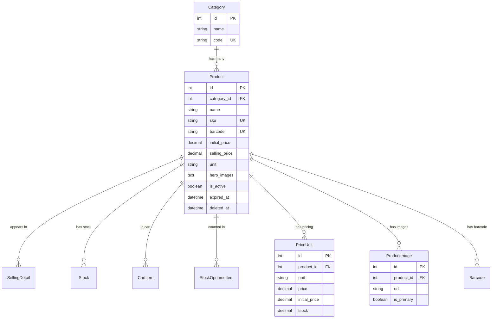
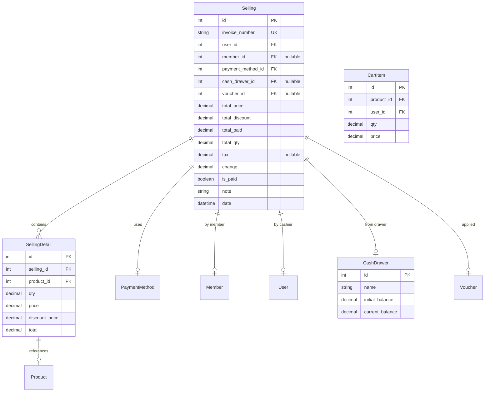
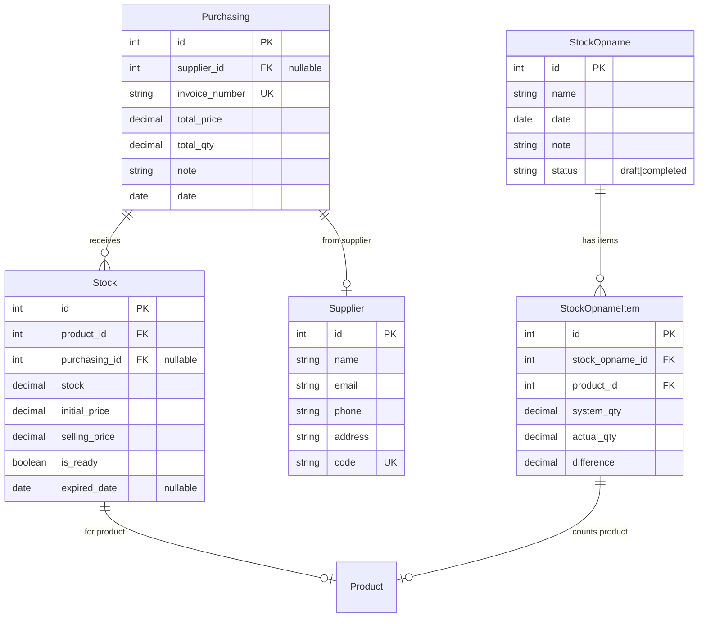
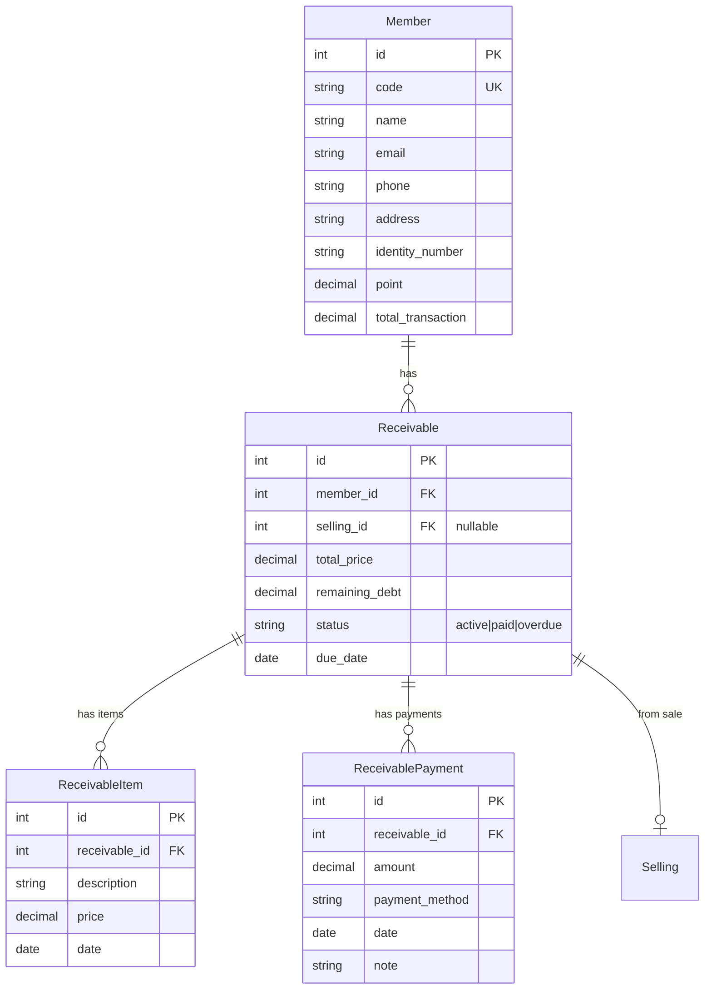
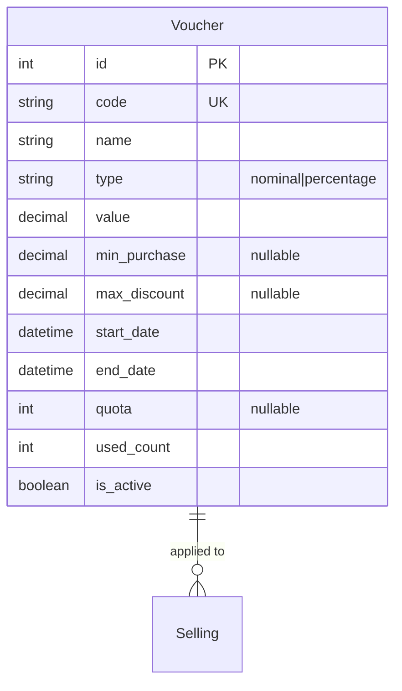
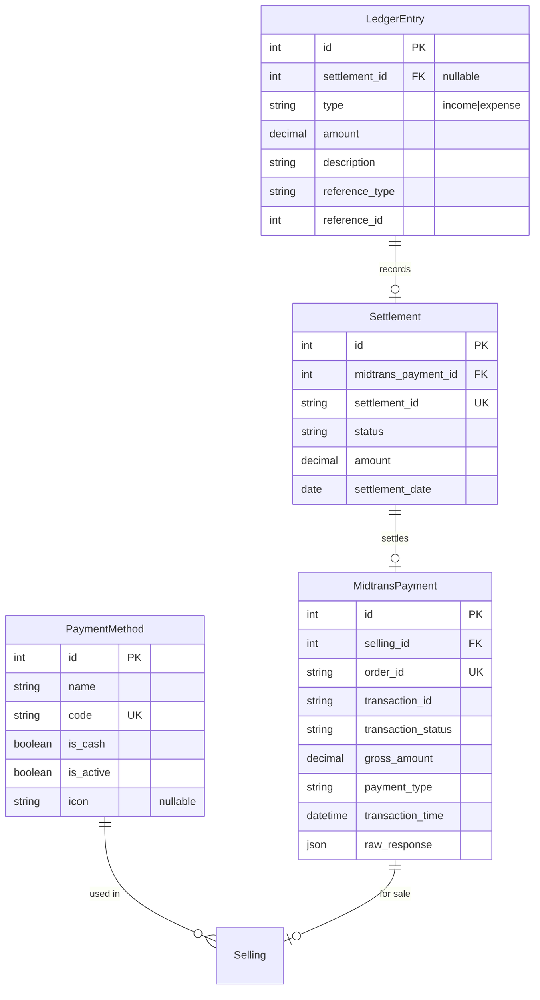
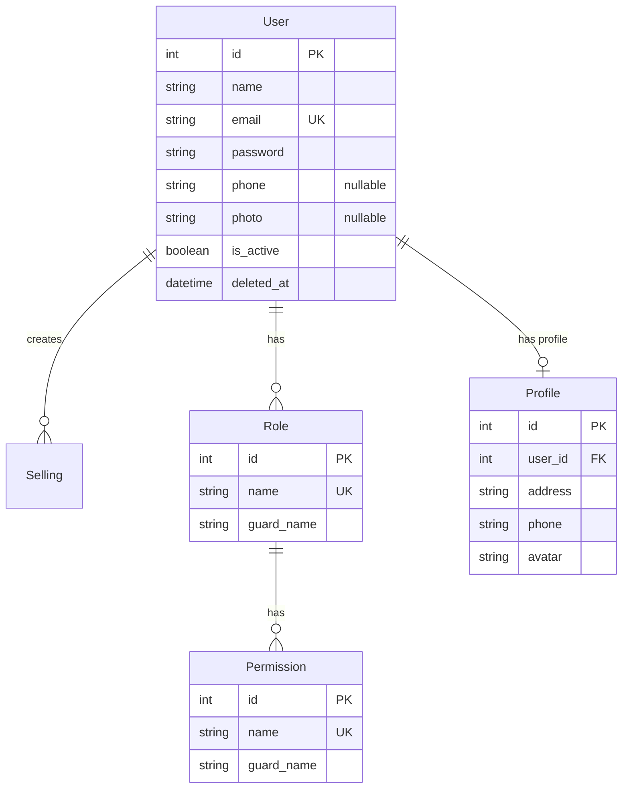

# zonaKasir — Database Schema (ERD)

> Entity-Relationship Diagram for tenant database.  
> All tables use `tenant_id` column for multi-tenant isolation.

---

## 1. Core Business Entities

---

## 2. Sales & Transaction

---

## 3. Inventory & Purchasing

---

## 4. Members & Receivables

---

## 5. Vouchers & Discounts

---

## 6. Payments & Settlements

---

## 7. Auth & Users

---

> **Last Updated:** June 20, 2026  
> **Related:** [Architecture Overview](./OVERVIEW.md) | [Flowcharts](./FLOWCHART.md)
