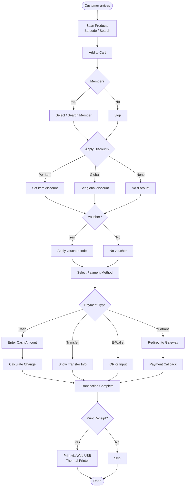
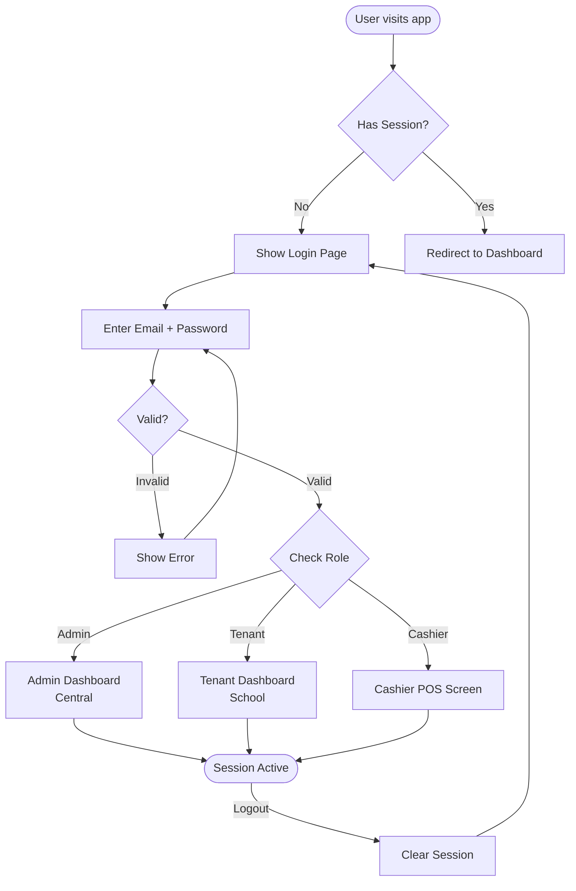
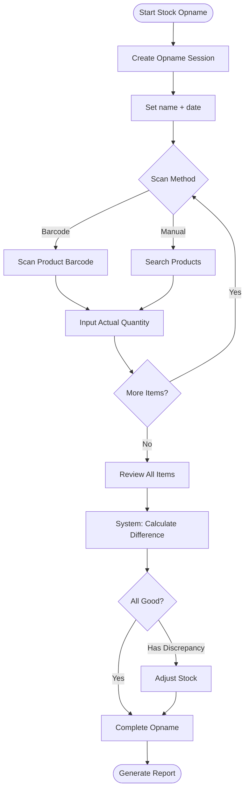
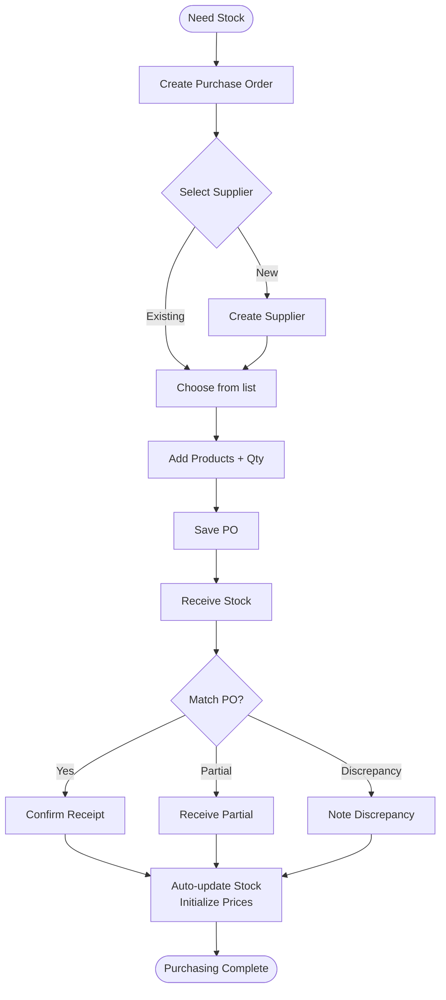
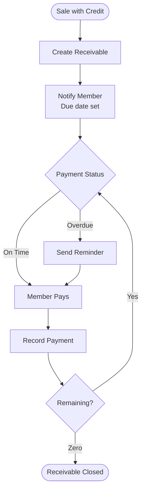
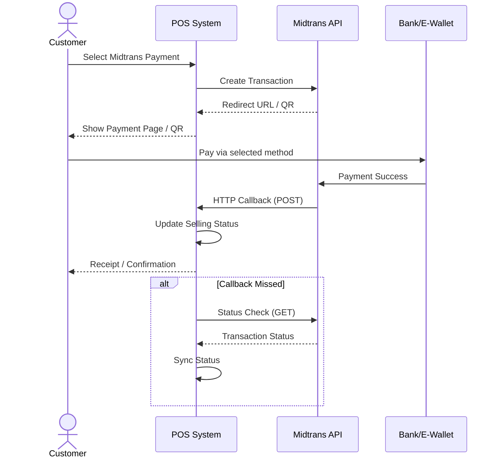
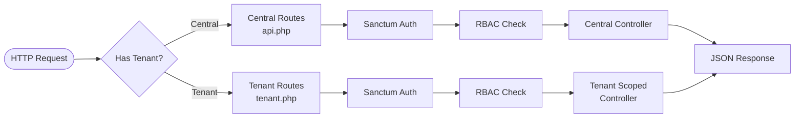

# zonaKasir — Business Flowcharts

> Key business processes visualized with Mermaid.

---

## 1. POS Transaction Flow

---

## 2. Auth & Login Flow

---

## 3. Stock Opname Flow

---

## 4. Purchasing Flow

---

## 5. Receivable Lifecycle

---

## 6. Midtrans Payment Flow

---

## 7. Multi-Tenant Request Flow

---

> **Last Updated:** June 20, 2026  
> **Related:** [Architecture Overview](./OVERVIEW.md) | [DB Schema](./DB_SCHEMA.md)
