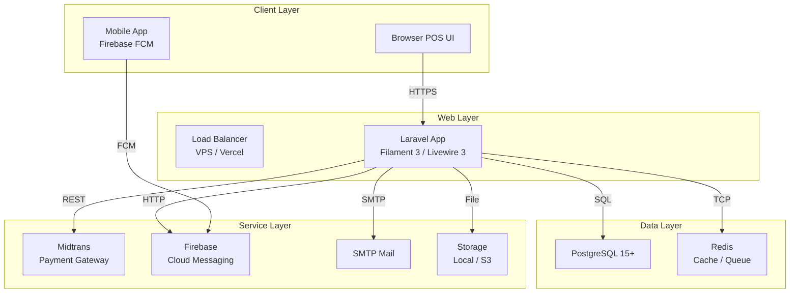
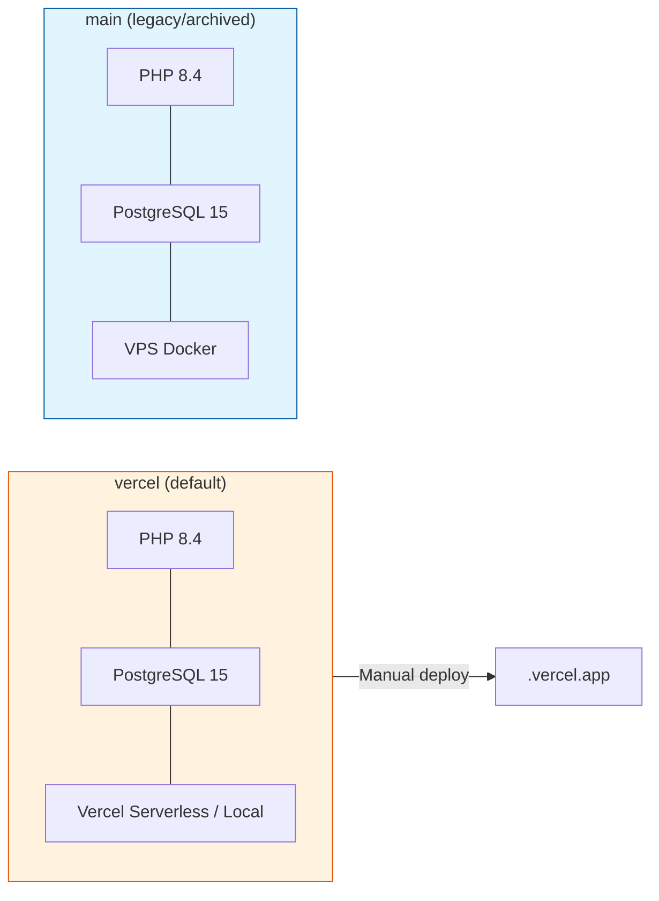
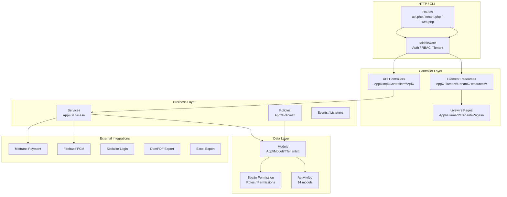
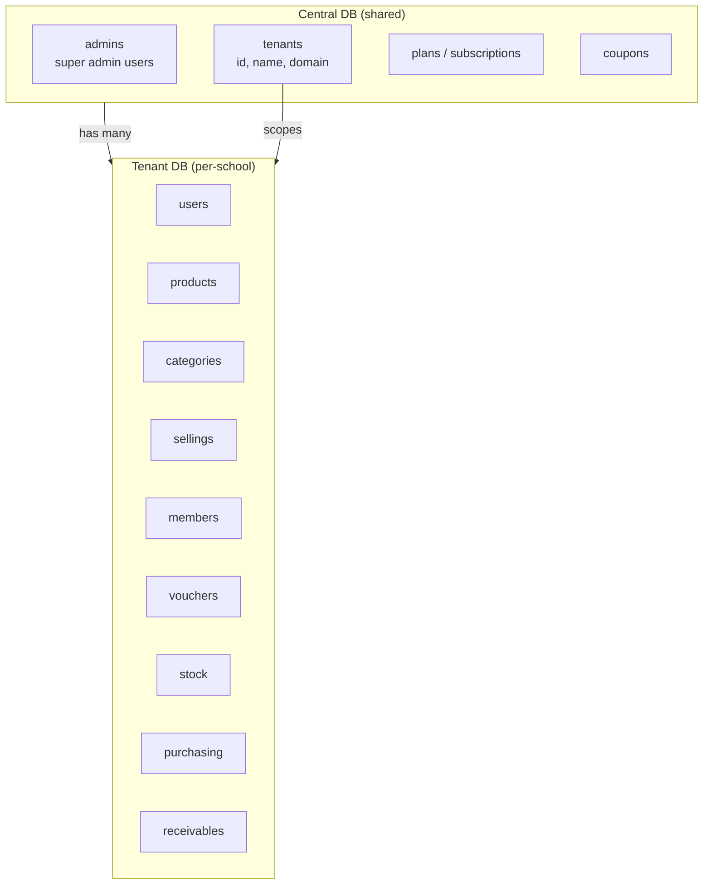
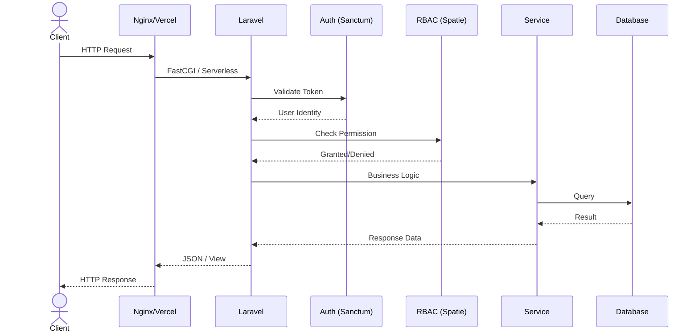

# zonaKasir — Architecture Overview

> System architecture, layer stack, and deployment topology.

---

## 1. System Architecture

---

## 2. Branch Architecture

---

## 3. Laravel Stack Layers

---

## 4. Multi-Tenant Data Model

---

## 5. Request Lifecycle

---

> **Last Updated:** June 20, 2026  
> **Related:** [DB Schema](./DB_SCHEMA.md) | [Flowcharts](./FLOWCHART.md) | [Repo Architecture](../planning/REPO_ARCHITECTURE.md)
